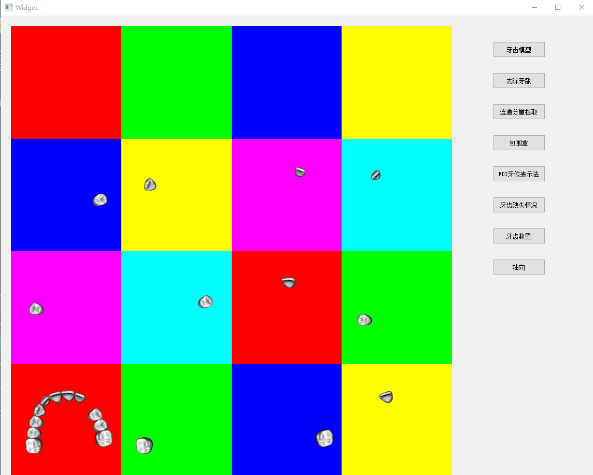
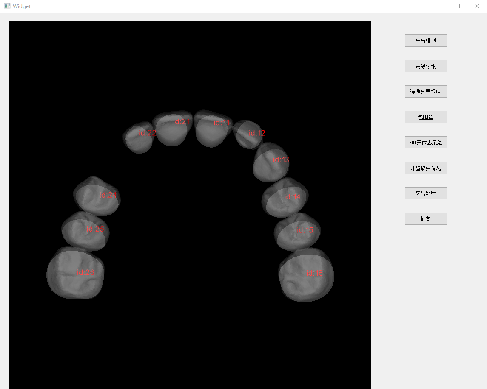
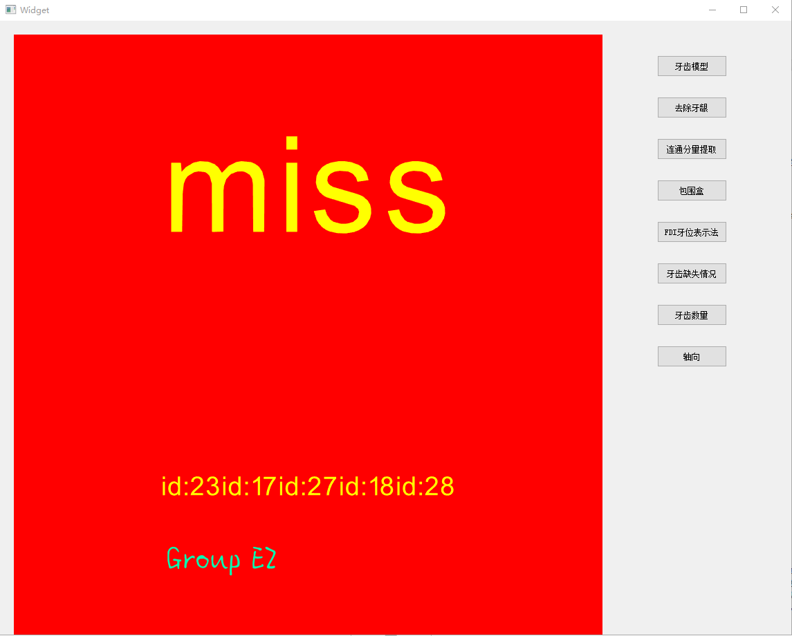
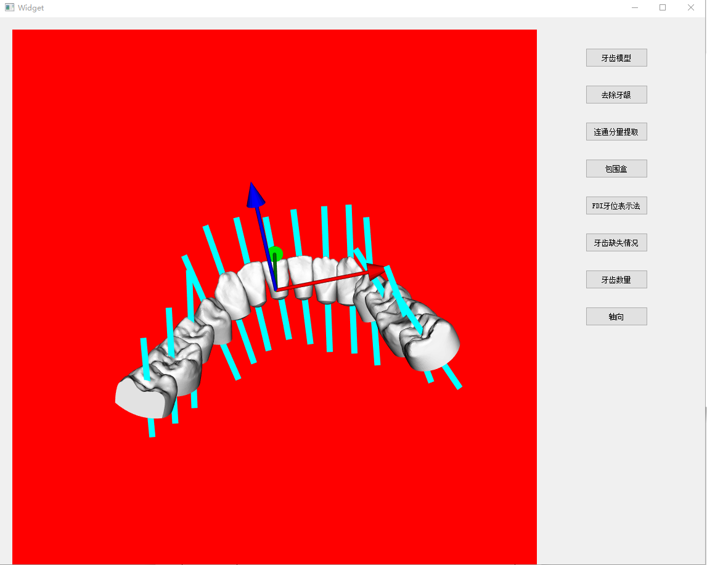

# **三维牙齿模型的自动化预处理**

Guofeng Yang, Hong Zhang in CSE@SJTU

## **项目简介**

上海交大2019年秋计算机图形学（CS337）课程设计 —— 三维牙齿模型的自动化预处理。提供未分割的整口牙的牙齿扫描数据（STL牙齿模型文件），要求开发出具有牙齿分割、计数、编号、牙齿轴向标定和牙齿缺失识别功能的系统，并将处理结果渲染到屏幕上，辅助牙医进行医疗诊断。开发工具为 `VS 2017` + `Qt5.13.2` + `Vtk8.2.0`。借助 `Vtk` 库，利用该库的工具函数进行牙齿的连通分量提取（即牙齿的分割），完成牙齿的计数；根据牙齿的中心点位置和包围盒的半径确定牙齿编号（FDI牙位表示法）和缺失情况；借助OBB包围盒确定牙齿轴向；利用 `Vtk` 的绘制函数将结果显示在屏幕上；借助 `Qt` 设计了简易的用户交互界面。 

## **环境配置**

本项目未上传整个工程，仅上传了源代码文件，见 `/scripts` 文件夹。`/data` 提供了一些可供实验的牙齿模型文件。如有运行需求，请按照如下步骤配置依赖环境。

* 安装Visual Studio 2017，VS是一个基本完整的开发工具集，选择套件时只需选择“使用C++的桌面开发”；
* 安装Qt 5.13.2，Qt是一个跨平台的C++图形用户界面应用程序开发框架，易扩展，可以嵌入VS进行开发使用，使用Vtk开发时会用到Qt进行GUI开发；然后在VS中安装Qt扩展插件，下载并安装QT Visual Studio Tools；
* 安装Cmake，Cmake是一个跨平台的编译工具，可以用简单的语句来描述所有平台的编译过程；
* 编译安装Vtk，用Cmake选择路径，然后Configure和Generate，就可以得到Vtk.sln文件，用VS 2017打开此工程文件，点击重新生成，开始长时间的编译过程，重新生成工作结束之后，环境配置完毕。

## **已实现的功能**

使用VS运行工程，会显示该系统UI界面
* 点击界面右栏中的【牙齿模型】按钮，会显示读取的牙齿模型，可通过鼠标点击、拖拽和滚轮的方式对牙齿模型进行旋转和缩放，以便全方位的观察。

  

* 点击【去除牙龈】：

  

* 点击【连通分量提取】，会显示将牙齿分成独立的各个牙齿的画面，其中包含去除牙龈后的整口牙的画面，和每个窗口显示单独的牙齿的画面：

  

* 点击【包围盒】，会显示出各个牙齿的OBB包围盒。

  

* 点击【FDI牙位表示法】，会显示各个牙齿使用FDI牙位表示法编号后的画面，红色的字体即为各个牙齿的编号：

  

* 点击【牙齿缺失情况】，若有缺失，窗口上半部分会显示“miss”，下半部分显示缺失的牙齿编号（包括智齿）；若无缺失情况，上半部分则显示“complete”。

  

* 点击【牙齿数量】，会显示输入牙齿模型的牙齿个数。

  

* 点击【轴向】，会显示添加了牙齿轴向的画面。

  

## **关键算法**

* **牙齿分割**

  前期通过数字扫描仪的多次精密扫描获得患者牙齿的点云数据，通过 **DBSCAN** 算法 （[一种密度聚类算法，参考可跳转至此](https://blog.csdn.net/huacha__/article/details/81094891)） 完成牙齿点云的聚类，再将各组点云三角化，就得到了完整的 STL 三维牙齿模型。  
  
  因此，对于一个作为输入的 STL 牙齿模型，其不同的牙齿之间不存在相邻的面片。类比寻找最大连通分量问题，我们可以考虑采用广度优先搜索，对面片进行聚类。但是，如果不对该算法进行优化，时间复杂度为面片的平方级。经实验，若未经优化，在 CPU 为 i7 7700 的计算机上运行该算法，含有14个牙齿（8万个面片）的模型需要40min才能分割完毕。

  鉴于此，本项目采取 Vtk 库特殊的 `VtkPolyDataConnectivityFilter` 类进行连通分量的提取。封装在该类中的工具函数使用特殊的数据结构保存三维模型的几何信息和拓扑信息，可完成面片的高效索引，从而大大加快连通分量的提取速度，在数秒内即可完成牙齿的分割工作。

* **牙齿编号和牙齿缺失情况的确定**
 
  首先要确定各个牙齿的中心点坐标和在XOZ平面上投影的半径，以便用于后续的计算。通过连通分量的边界变量Bound，得到各个牙齿的AABB包围盒的顶点坐标，再通过简单的计算，即可得到牙齿的中心点坐标和投影半径。接下来，在此基础上，进行牙齿编号和缺失识别的计算。
 
  牙齿的编号建立在牙齿缺失识别的基础上进行，在得到正确的牙齿编号后，便可以通过遍历现有牙齿的编号，与完整的牙齿编号进行比对，输出牙齿缺失情况。

  对于牙齿缺失的识别，我们从左往右扫描牙齿模型（即按照中心点坐标x递增的顺序遍历各个牙齿），根据每颗牙齿的中心点坐标，计算相邻两颗牙齿的中心点坐标之间的距离在XOZ平面上的投影，如果这个值大于这两颗牙齿的半径之和，则表明这两颗牙齿之间存在缺失的牙齿。为了便于后续编号，对于缺牙的地方，填充一个“空牙齿”（没有面片，但有中心点和半径等信息），“空牙齿”会被标记为“空”。

  接下来进行牙齿的编号，牙齿编号采用的方法如下：
  * 首先确定第一颗右门牙。确定方法：中心点x坐标为正值且最小的那颗牙齿即为右门牙。注：即便右门牙缺失，鉴于在缺失识别阶段已经填充了“空牙齿”，所以没有影响。
  * 对右门牙进行编号。
  * 以右门牙为基准，沿中心点x坐标值递增的方向，对右侧的牙齿进行挨个编号。
  * 确定左门牙。确定方法：利用牙齿中心点坐标来确定，左侧离右门牙最近的牙齿即为左门牙。
  * 进行左侧牙齿的命名，沿中心点x坐标值递减的方向，对左侧的牙齿进行挨个编号。
  * 将各个非空牙齿的名称按照连通分量的顺序保存，输出。

  由此就得到了各个牙齿连通分量对应的编号，完成了牙齿的命名工作。代码实现详见 `scripts/tooth.h` 。

  本算法能保证较高的鲁棒性，即便是缺失了门牙或者最边缘的磨牙，依然能对牙齿进行正确的编号和缺失情况的正确识别。同时，该算法对牙齿进行编号的根据是牙齿坐标，而不是牙齿的具体形态，简单高效而又不失准确性。

## **未来需要优化的部分**

* 对连续缺失两颗以上牙齿的情况的处理不周。当有两颗以上牙齿连续的缺失时，算法只会补上一颗很大的“空牙齿”，而这会导致缺失部位周围牙齿的编号错误，因为两侧的牙齿的编号依赖于相对中间的牙齿的编号，因此会导致连续的错误。可以考虑的解决方案为：当两颗牙的中心的间距大于半径之和的二倍时，添加连续两颗“空牙齿”。连续缺失三颗乃至以上的情况同理。但是这样处理的问题是，系统的计算是直接计算两颗牙齿中心点之间的直线距离，当连续缺失的牙齿个数较多时，由于牙齿排列是有弧度的，依赖直线距离进行牙齿缺失的判断的误差会变大，导致编号和缺失识别不准确，因此对连续多颗牙齿缺失情况的识别，该系统还是需要进一步改善，改善的思路可以考虑根据牙模弧度来矫正牙齿中心点之间的距离的计算。
* 在牙齿特征点的识别方面，比如牙尖的识别，虽然也进行了曲率特征的可视化分析，但主要采取的方法还是利用OBB包围盒的轴向来近似牙齿的牙尖方向，这个估计的误差还是挺大的。将来的工作应考虑深入研究利用曲率来识别牙尖的方法，通过曲率计算，精确的标记出各个牙齿的牙尖方向。

